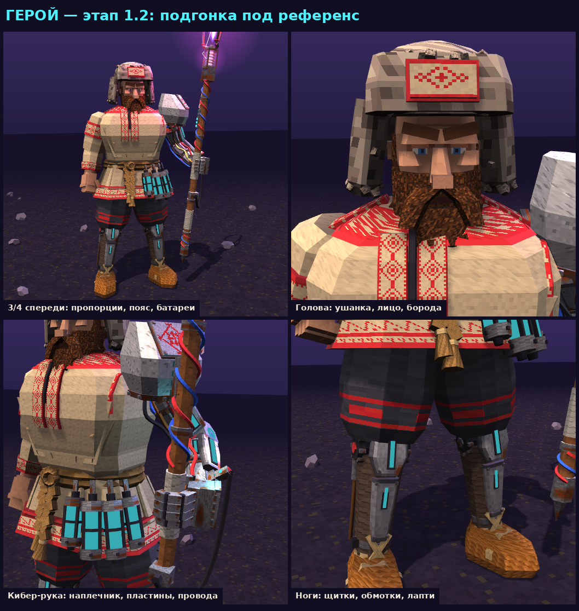

# Киберслав: герой-копейщик (three.js-прототип)

Процедурная низкополигональная модель героя для 3D-рогалика в стиле славянского киберпанка:
плазменное копьё, кибер-рука, тело с рубахой, ушанкой, поясом с батареями, наколенниками и лаптями.
Всё строится кодом (three.js r128), текстуры — пиксельные DataTexture 8–64 px, генерируются тоже кодом.



## Быстрый старт

Откройте `dist/index.html` в браузере — это готовая самодостаточная страница (three.js грузится с cdnjs).

Управление: мышь — вращение камеры, колесо — зум; кнопки и клавиши действий копья и руки — на панели страницы.

## Структура

```
src/            исходники по частям (склеиваются в одну страницу)
  head.html     <head>, стили
  body.html     панель управления
  world1.js     помощники, текстуры, сцена, свет и карта окружения, модель копья
  world2.js     кибер-рука: модель, риг, кабель
  world2b.js    тело героя: лофт/скошенные боксы, скелет, одежда, голова, пояс, ноги, правая рука, Grip, запечённое затенение
  world3.js     состояние, IK, анимационный шаг, API
  ui.js         рендерер, ввод, UI
dist/index.html собранная страница
build.sh        сборка src → dist + проверка синтаксиса (нужен Node.js)
tools/render/   рендер без браузера (node + headless-gl) для листов рендеров
docs/           листы рендеров
```

Правьте файлы в `src/`, затем `./build.sh`.

## Иерархия (пивоты для анимации)

```
ArmPivot > ArmFrame > Hips > Spine > Chest > Neck > Head > HeadMesh > (Face, Beard, Ushanka)
Chest > RightShoulder > RightUpperArm (RightSleeve) > RightForearm > RightHand > RightFist > RightThumb
Chest > Shoulder > UpperArm > Forearm > Hand > Finger1..4_1..3, Thumb_1..2, Grip > Spear
Hips > Left/RightUpLeg > Left/RightLeg > Left/RightFoot
SpearRoot > yaw > tilt > SpearTarget   (невидимый контроллер: к нему тянется IK кибер-руки)
```

Оси внутри ArmFrame: +X — левая (кибер) сторона героя, +Y вверх, +Z вперёд.

## Рендер без браузера (Linux)

```
cd tools/render
npm install            # three@0.128.0, gl@8 (нужны build-essential, libxi-dev, libglu1-mesa-dev)
mkdir -p out
xvfb-run -a node render.js "$(cat jobs/stage1_2.json)"
python3 topng.py out/r1 out/r2 out/r3 out/r4      # нужен Pillow
```

Описание кадра в JSON: `out`, `arm`, `plasma`, `tier`, `armAct`, `act`, `t` (секунды), `cam` {theta, phi, r, tx, ty, tz}.

## Статус

- [x] Копьё, кибер-рука, анимации копья и руки
- [x] Этап 1: пропорции, хват копья механической рукой
- [x] Этап 2: голова, борода, ушанка, корпус и рубаха
- [x] Этап 1.1, доработка головы и корпуса: пропорции (бедро 0.42 → 0.65, подол до верха бедра, от подола до стопы 41 % роста), лицо +20 %, ушанка −15 %, мех и борода разведены по цвету и фактуре, рукав с вышивкой у плеча и манжетой, вышитое кольцо ворота и прямые полосы разреза, складки на груди, мягче ключевой свет, копьё в стойке без пересечений с телом
- [x] Этап 1.2, подгонка под референс: пропорции (колено на 27 % роста, подол → стопа 43 %, голова ×0.85), бронированные колени и голени, кожаные обмотки, лыковые ремни, крупные лапти; пояс в два оборота с узлом, косами, ремнями и четырьмя батареями; кибер-рука с массивным наплечником, пластинами с неоном и пучком проводов; большая ушанка с пушистым краем, лицо с веками и голубыми глазами; шире корпус и рукава; узоры вышивки подола и рукава по референсу; карта окружения и запечённое затенение. Около 16 тыс. треугольников вместе с копьём
- [x] Этап 1.3: кибер-рука врастает в корпус (наплечник накрывает плечо рубахи, короткий рукав с вышитым краем вокруг сустава); анимации тела: ноги на IK по двум костям со ступнями на земле, шаговый цикл бега, наклон и скрутка корпуса, шея держит взгляд, живая рука машет; свои ключи тела для тычка, размаха, подката, прыжка, броска, включения и выключения плазмы (`animateBody` в world2b.js)
- [ ] Следующие этапы: руки, пояс, ноги; затем анимации тела
- [ ] Перенос в Blender (bpy) → FBX/GLB для Unity
